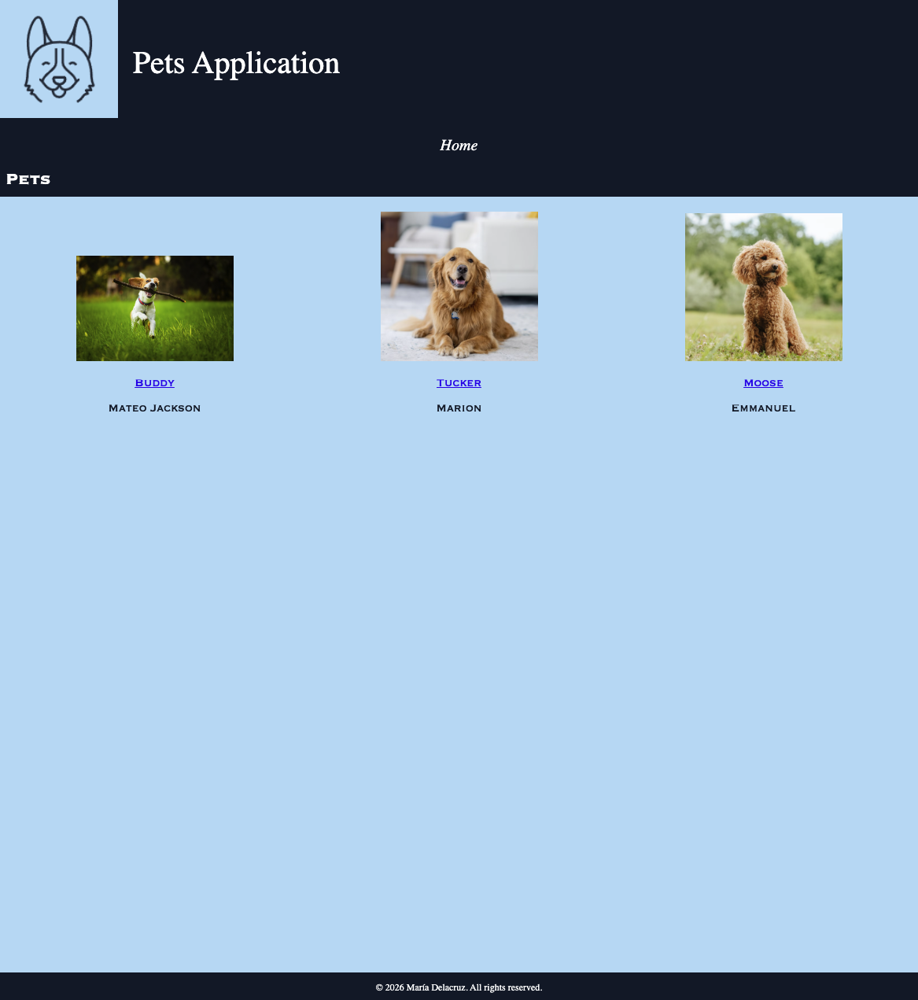
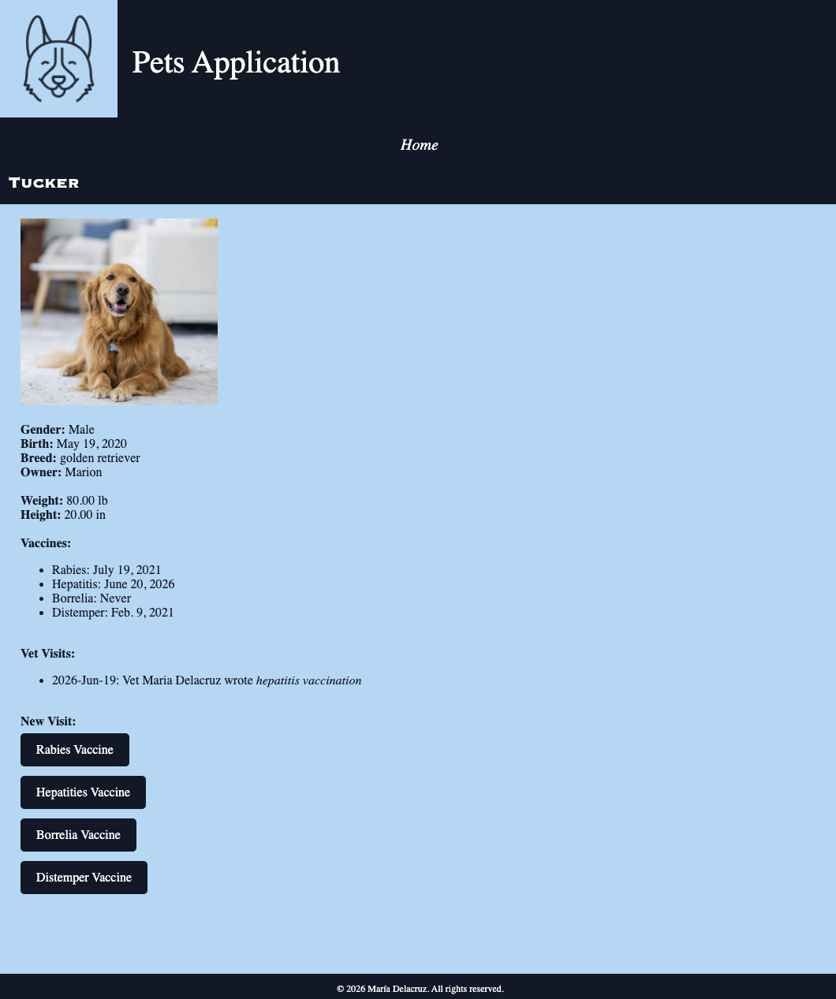

# Pets App




## Table of Contents
- [Setup](#setup)
    - [Database](#database)
    - [Django Shell](#django-shell)
        - [Object Lookup](#object-lookup)
- [Apps](#pets_all)

## Setup

1. Create and activate virtual environment:
    ```bash
    python3 -m venv .venv
    source venv/bin/activate
    ```
2. Install Django package:
    ```bash
    pip install django
    ```
3. Run migrations:
    ```bash
    python3 manage.py makemigrations
    python3 manage.py migrate
    ```
4. Start the server:
    ```bash
    python3 manage.py runserver
    ```

## Database

Install sqlite 3 SQL client
    ```
        sudo yum install -y sqlite
    ```

Create tables
    ```
    sqlite3 -line db.sqlite3 '.tables'
    ``` 

Run the following command to show data
    ```
    sqlite3 -line db.sqlite3 'SELECT * FROM pets_app_pet'
    ```

## Django Shell

1. Start the Django shell:
    ```
    ./manage.py shell
    ```
2. Create an object:
    .save() -> commits changes to the database 
    ```
    from pets_app.models import Breed
    husky = Breed(name='Husky', weight=10, height=10)
    husky.save()
    ```
3. Create a vaccination card:
    ```
    from pets_app.models import VaccinationCard
    from datetime import datetime
    card1 = VaccinationCard (rabies = datetime(2021, 7, 19), hepatitis =
    datetime(2021, 8, 1), distemper = datetime(2021, 2, 9))
    card1.save()
    card2 = VaccinationCard (rabies = datetime(2024, 8, 16), hepatitis =
    datetime(2023, 7, 6), distemper = datetime(2023, 12, 9))
    card2.save()
    ```
5. Update column in table:
    ```
    sqlite3 -line db.sqlite3 'UPDATE pets_app_pet set owner="name" WHERE name="pet_name"'
    ```

4. Exit Shell:
    ```
    quit() or Ctrl+D
    ```

### Object Lookup

1. Open the shell:
    ```
    ./manage.py shell
    ```

2. Check all models:
    ```
    from pets_app.models import Pet, Gender, Breed, VaccinationCard
    ```

3. Retrieve all objects:
    ```
    all_breeds = Breed.objects.all()
    all_breeds
    ```
4. Retrieves a specific object:
    ```
    all_breeds[0]
    ```

5. Update Vaccination Card:
    ```
    card1 = VaccinationCard.object.get(id=1)
    print(card1.borrelia)
    ```

6. Delete object & Check it doesn't exist:
    ```
    husky = Breed.objects.filter(name="Husky")[0]
    husky.delete()
    Breed.objects.all()
    ```
-----
-----

## Apps

### pets_app

Models:
- `Breed` - stores breed name, weight, and height
- `VaccinationCard` - tracks rabies, hepatitis, borrelia, and distemper vaccination dates
- `Pet` - stores pet info (name, gender, birth, owner, weight, height) linked to a `Breed` and `VaccinationCard`
- `VetVisit` - records vet visits with date and notes, linked to a `Pet`